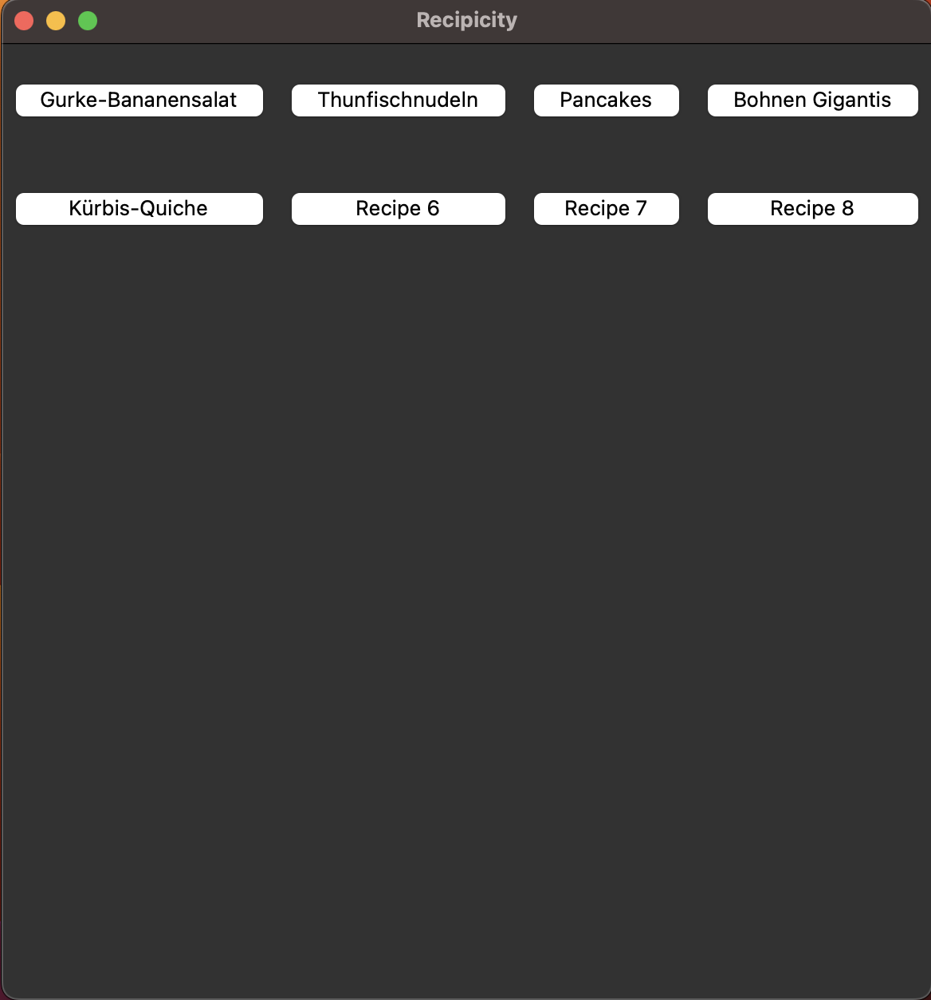
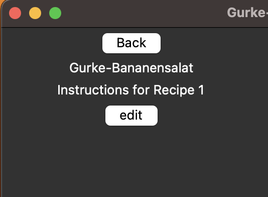
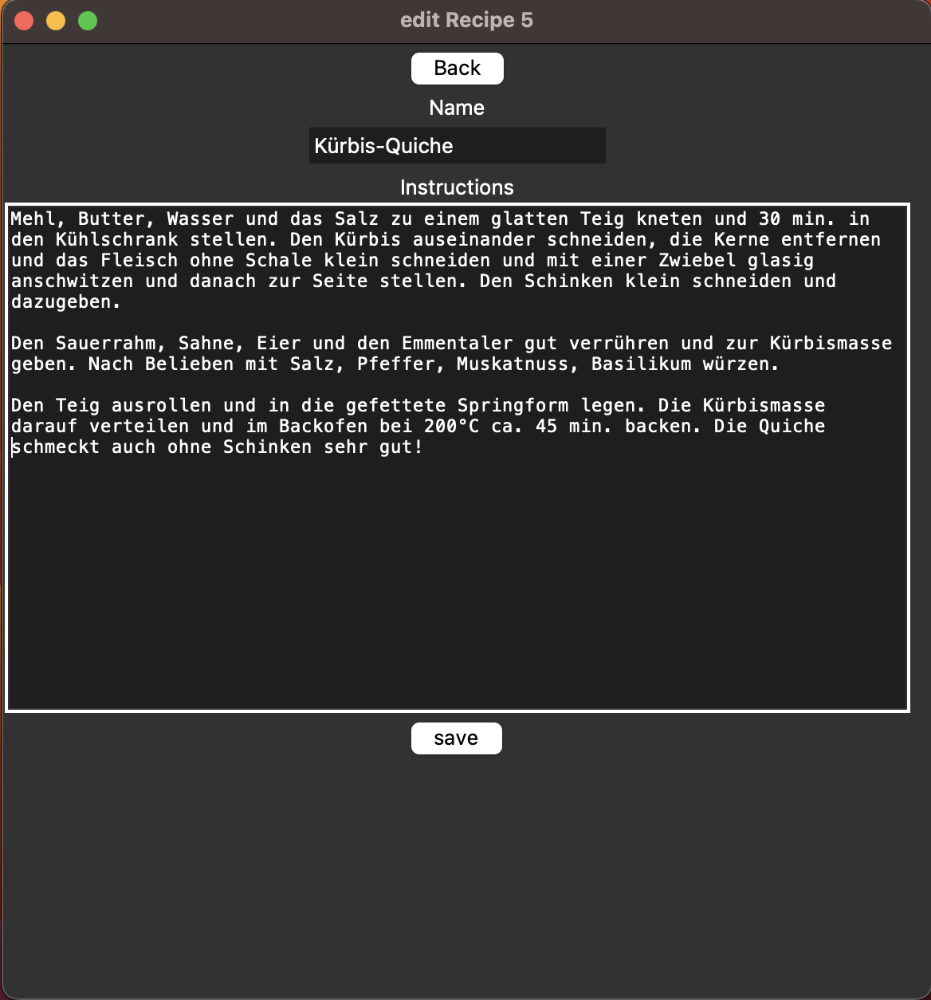

## Introduction
Recipicity is recipe mangager and recommender. It currently only runs on my local mashine, as the databank is also local.

## Prerequisites
- Python 3.11+
  - tkinter
  - functools
  - os
  - mysql.connector
- Mysql

## Execute
Run main.py

## Screenshots of GUI
- 
- 
- 

